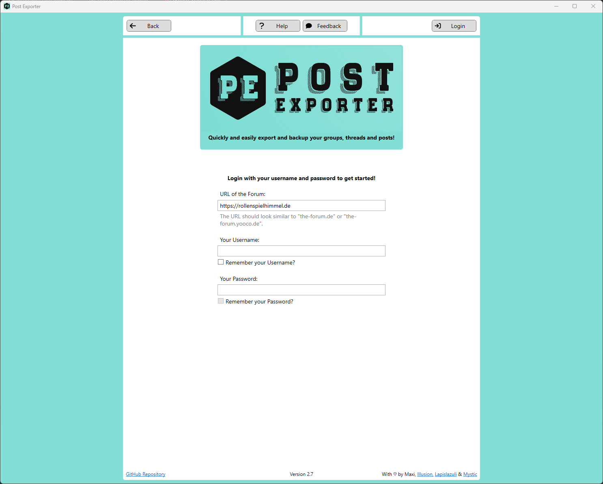
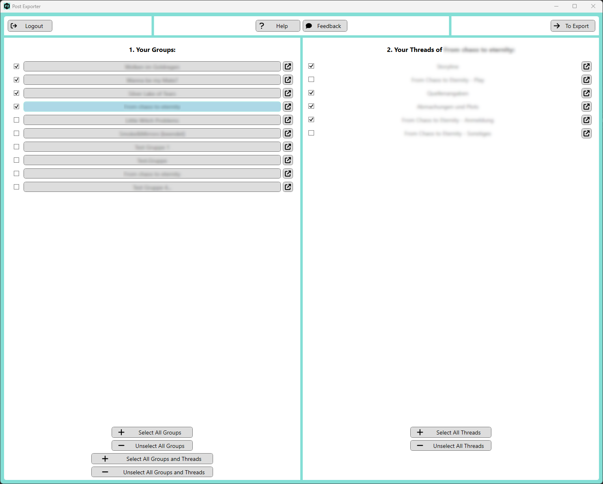
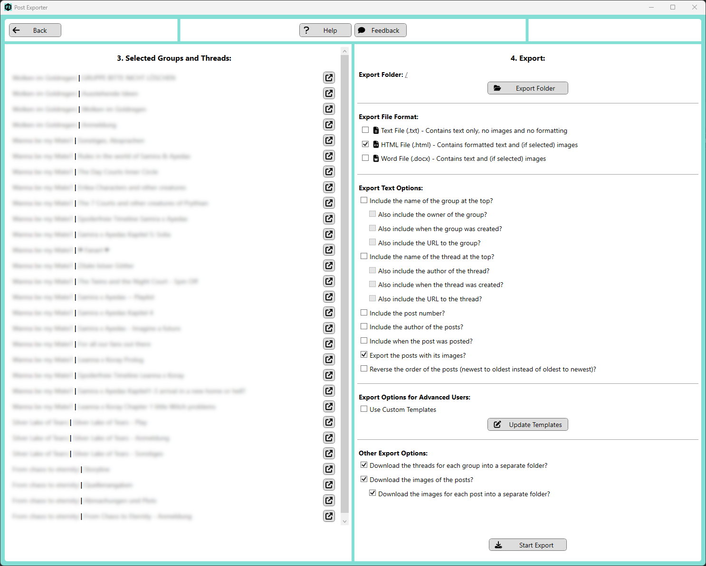

<p align="center">
  
</p>

[](https://choosealicense.com/licenses/mit/)
[](https://github.com/maximilian-hammerl/post-exporter/releases)
[](https://github.com/maximilian-hammerl/post-exporter/search?l=c%23)


.NET 9.0 [WPF](https://learn.microsoft.com/en-us/visualstudio/designers/getting-started-with-wpf) application to export groups, threads and posts of [Yooco](https://www.yooco.de) forums to various file formats

## Screenshots

|                              Page |                                     Screenshot                                      |
|----------------------------------:|:-----------------------------------------------------------------------------------:|
|                        Login Page |    |
| Groups and Threads Selecting Page |  |
|                    Exporting Page |  |

## Dependencies

- [FontAwesome 6 Svg](https://github.com/MartinTopfstedt/FontAwesome6): WPF integration of [Font Awesome](https://fontawesome.com/)
- [Html Agility Pack](https://html-agility-pack.net): Parsing HTML
- [Open XML SDK](https://github.com/OfficeDev/Open-XML-SDK): Generating Word documents
- [Html2OpenXml](https://github.com/onizet/html2openxml): Converting HTML to OpenXml components for Word documents
- [JetBrains Code Annotation Attributes](https://www.jetbrains.com/help/resharper/Code_Analysis__Code_Annotations.html)
- [Sentry](https://sentry.io/for/csharp/): Error and performance monitoring

## Publish

Build a single executable with these settings:

```
configuration="Release"
delete_existing_files="true"
include_native_libs_for_self_extract="true"
platform="Any CPU"
produce_single_file="true"
ready_to_run="true"
runtime="win-x64"
self_contained="true"
target_folder="$PROJECT_DIR$/PATH/TO/TARGET_FOLDER"
target_framework="net9.0-windows"
```
